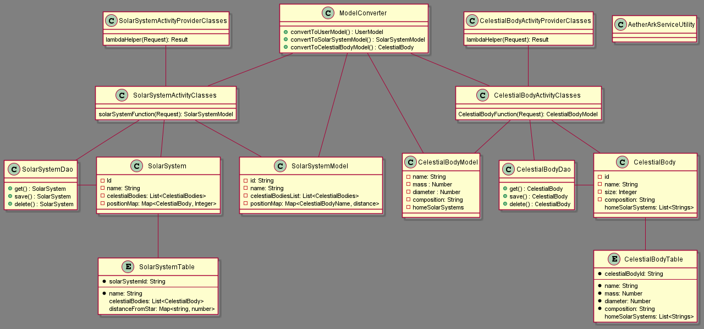
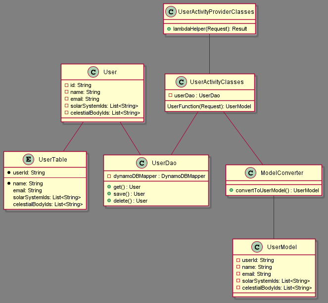
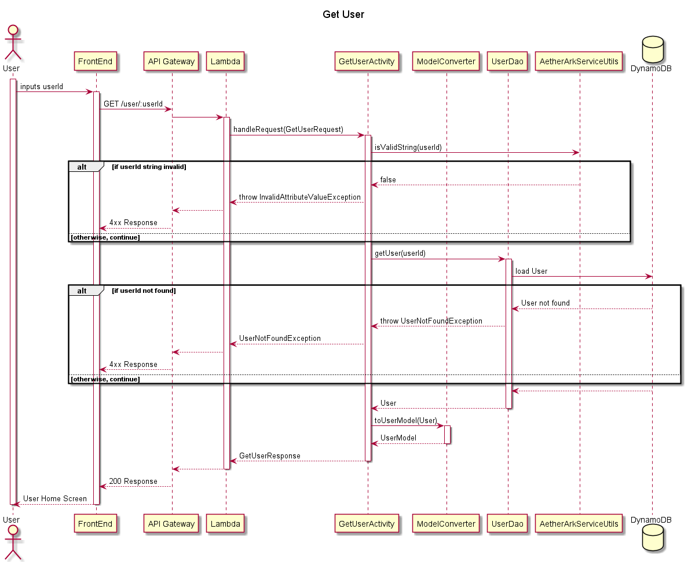
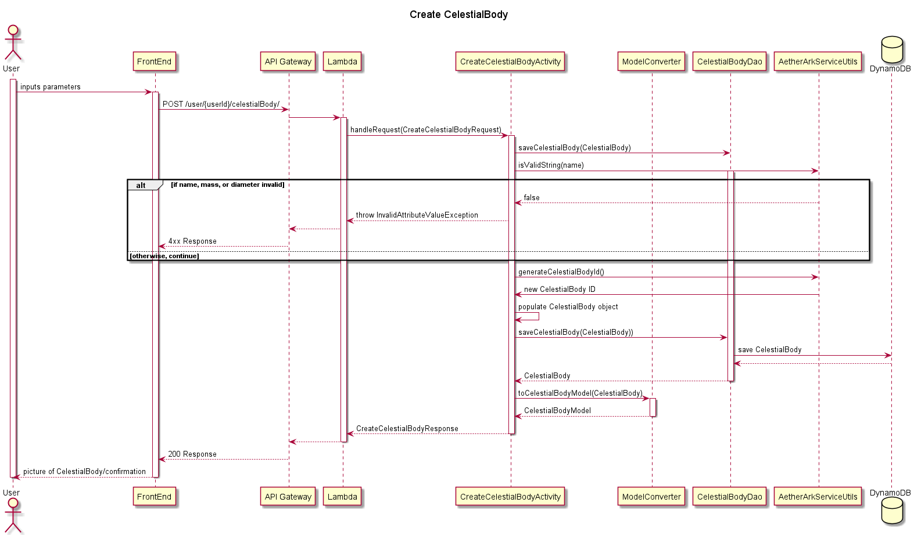
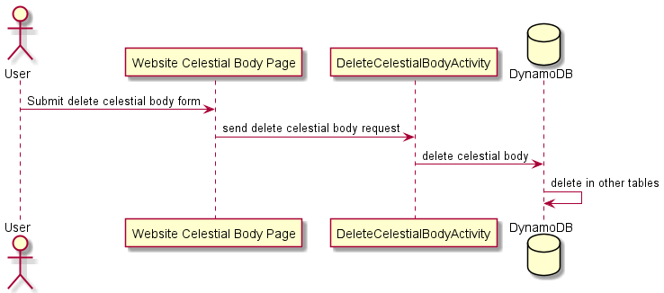
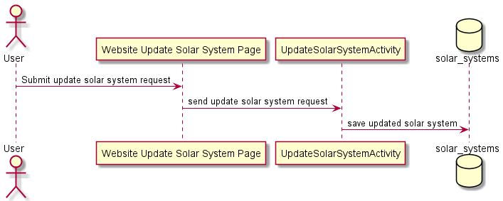
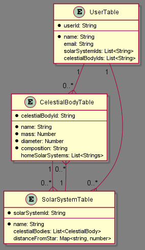
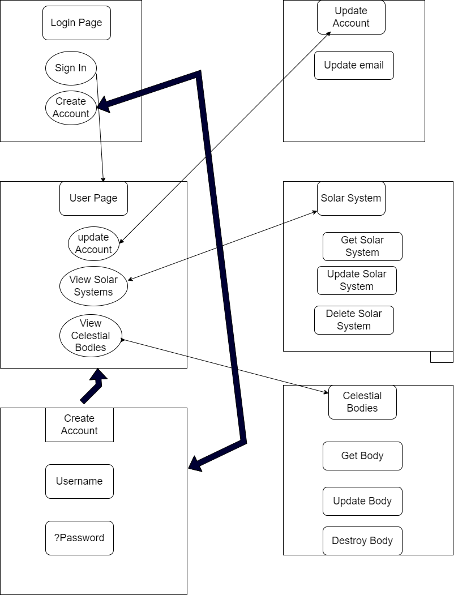

# Team Aether Ark Design Document

## *Aether Ark* Design

## 1. Problem Statement

This service will allow a user to create their own solar system. The user can input values for each celestial body they
want to create, and will be shown a visual representation of the system that they make. Celestial objects will be made 
separately and then added or removed from a solar system.


## 2. Top Questions to Resolve in Review

1. Do we want to use a "Soft Delete" with isDeleted? We would have to add that to the database models.
2. Can a data model be composed of other objects? Or do the attributes have to be primitives and Strings?
3. Should we have user validation?
4. Do we want to have a predefined set of planets?
5. Should users define initial speed and/or distance from solar body?
6. How to do the front-end part of the program?
7. How in-depth will the visuals be, and how to implement them?
8. How will we know the project is full-featured enough?
9. Whether a user will have a profile to login to Aether Ark (login page & main page: 2 pages)?
10. Can users create a multiple star system?
11. Should we have motion?
12. Do we want to connect to an outside API?
13. Should we use a DAO interface? Would it have a benefit?
14. What is our MAX? Distance from sun, mass, diameter, amount of bodies, amount of 
solar systems, bodies in solar systems

## 3. Use Cases

As an Aether Ark customer I want to:
1. Create a new user account.
2. Log into my user account.
3. Update my account information.
4. Delete my user account (including all planets and solar systems)

5. Create a new solar system with custom properties (#of stars, planets with distance from star(s))
6. Retrieve a list all of my solar systems.
7. View a single solar system from all of my available solar systems.
8. Update an individual solar system.
    1. Update my solar systems name.
    2. Add a planet with a distance in relation to it's star(s).
    3. Delete a plant from the solar system. DESTROY!
    4. Make changes to an individual planet within a solar system. (updates planet in 
   planets table and solar system)
9. Delete a solar system.
10. Delete all of my solar systems.

11. Create individual custom planets.
12. Retrieve one planet I have made.
13. Retrieve all planets I have made.
14. Update an individual planet (updates planet in planets table and solar system).
15. Delete an individual planet (updates planet in planets table and solar system).

## 4. Project Scope

### 4.1. In Scope
-Creating, retreiving, updating and deleting a solar system

-Creating, retreiving, updating and deleting celestial bodies

-Add and remove planets to and from solar systems

- look at all planets (separate from the solar systems they belong to)
- store profiles, create log in page, show the user if they are logged in or not

### 4.2. Out of Scope

-Connecting to Nasa's API to retrieve real world information concerning actual solar systems

-Displaying a moving image of the custom solar system to the user via the front-end

-Update username if new name is available

# 5. Proposed Architecture Overview

This initial iteration will provide the minimum viable product including creating, retrieving, updating and
destroying a custom solar system through a front-end user interface. It will also provide the ability to create, 
update, retrieve and destroy
individual celestial bodies, as well as add and remove them from solar systems(the update functionality)
We will use API Gateway and Lambda to create 19 endpoints
(CreateUser, GetUser, UpdateUser, DestroyUser, 
CreateCelestialBody, GetCelestialBody, UpdateCelestialBody, DestroyCelestialBody, 
DestroyAllCelestialBodies,
CreateSolarSystem, GetSolarSystem, UpdateSolarSystem, DestroySolarSystem,
GetAllSolarSystems, DestroyAllSolarSystems, AddACelestialBodyToSolarSystem, UpdateCelestialBodyInSolarSystem,
DestroyACelestialBodyFromASolarSystem)

We will store celestial bodies available for solar systems in a DynamoDB table. 
Solar systems themselves will also be stored in a DynamoDB table.
User profiles will be stored in a separate DynamoDB table.
For easier celestial body list retrieval, we will store the list of bodies in a given solar system directly in the 
solar system table.

Aether Ark will provide a web interface for users to manage their solar systems. A login page for users to login or 
create an account, and main page for users to choose between
creating, updating, retrieving, and deleting celestial bodies and solar systems.






# 6. API

## 6.1. Public Models
````
//UserModel
String id; 
String name; 
String email; 
List<String> solarSystemIds; 
List<String> celestialBodyIds; 
````
````
//CelestialBodyModel
String id;
String name;
Integer mass;
Integer diameter;
String composition;
List<String> homeSolarSystems;
````
````
//SolarSystemModel 
String id;
String name;
List<CelestialBody> celestialBodies;
Map<String, Integer> distanceFromStar;
````

## 6.2. GetUser Endpoint

Accepts `GET` requests to `/user/:userId`

Accepts a user ID and returns the corresponding UserModel.
If the given user ID is not found, will throw a
     `UserNotFoundException`



## 6.3 CreateUser Endpoint

Accepts `POST` requests to `/user/`

Accepts data to create a new user with a provided username and an optional email.
Returns the new user, including a unique user ID assigned by the Aether_Ark Service
Utility.
For security concerns, we will validate the provided username does not
  contain any invalid characters: `" ' \ `
If the username contains any of the invalid characters, will throw an
     `InvalidAttributeValueException`.
If the given username already exists, will throw a
  `UserNameAlreadyExistsException`

##6.4 UpdateUser Endpoint
Accepts `PUT` requests to `/user/:userId`

Accepts user ID and data to update a user with any changes to email
Returns the updated User.
The username may not be updated at the moment.
For security concerns, we will validate the provided username has not changed.
If the username has changed, will throw a
`InvalidAttributeValueException`
If the given user ID is not found, will throw a
`UserNotFoundException`

##6.5 DestroyUser Endpoint
Accepts `DELETE` requests to `/user/:userId`

Accepts a user ID and deletes ALL!!! user data from this service. 
Returns the deleted user.
Will throw a
`UserNotFoundException`

## 6.6 GetCelestialBody Endpoint
Accepts `GET` requests to `/user/:userId/celestialBody/:celestialBodyId`

Accepts a user ID and celestialBody ID and returns the corresponding CelestialBodyModel.
If the given celestialBody ID is not found, will throw a
`CelestialBodyNotFoundException`
If the given user ID is not found, will throw a
`UserNotFoundException`

## 6.7 CreateCelestialBody Endpoint
Accepts `POST` requests to `/user/:userId/celestialBody`

Accepts userId and data to create a new celestial body with a provided name, mass, diameter,
and composition. Updates user celestialBodyIds list to include new celestialBody.
Returns the new celestial body, including a unique ID assigned by the Aether_Ark Service
Utility.
For security concerns, we will validate the provided celestial body name does not
contain any invalid characters: `" ' \ `
If the celestial body contains any of the invalid characters, will throw an
`InvalidAttributeValueException`.
The mass and diameter must be greater than 1 otherwise, will throw an
`InvalidAttributeValueException`



## 6.8 UpdateCelestialBody Endpoint
Accepts `PUT` requests to `/user/:userId/celestialBody/:celestialBodyId`

Accepts userId, celestial body ID and data to update a celestial body with any changes to name, mass, diameter,
and composition. Updates homeSolarSystems to reflect new changes in celestialBody.
Returns the celestial body.
For security concerns, we will validate the provided celestial body name does not
contain any invalid characters: `" ' \ `
If the celestial body contains any of the invalid characters, will throw an
`InvalidAttributeValueException`.
Validate mass and diameter greater than 1 otherwise, will throw an
`InvalidAttributeValueException`
will throw a
`CelestialBodyNotFoundException`
`UserNotFoundException`

## 6.9 DestroyCelestialBody Endpoint
Accepts `DELETE` requests to `/user/:userId/celestialBody/:celestialBodyId`

Accepts a user ID, celestial body ID, and deletes the celestial body from this service.
Updates user and solarSystem celestialBodyIds list to reflect deleted celestialBody.
Returns the deleted celestial body.
will throw a
`CelestialBodyNotFoundException`
`UserNotFoundException`




## 6.10 GetAllCelestialBodies Endpoint
*we might be able to this by getting the userModel. It contains a list of CelestialBodies*

Accepts `GET` requests to `/user/:userId`

Accepts a user ID and returns the list of all celestial bodies
will throw a
`NoCelestialBodyFoundException`
`UserNotFoundException`

## 6.11 DestroyAllCelestialBodies Endpoint
*we might be able to do this by updating the userModel. It contains a list of CelestialBodies*

Accepts `DELETE` requests to `/user/:userId`

Accepts a user ID and returns the list of all celestialBodies
If no celestial bodies are found, will throw a
`NoCelestialBodyFoundException`
If the given user ID is not found, will throw a
`UserNotFoundException`

## 6.12 GetSolarSystem Endpoint
Accepts `GET` requests to `/user/:userId/solarSystem/:solarSystemId`

Accepts a user ID, solar system ID, and returns the corresponding solar system model.
If the given solar system ID is not found, will throw a
`SolarSystemNotFoundException`
If the given user ID is not found, throw a
`UserNotFoundException`

## 6.13 CreateSolarSystem Endpoint
Accepts `POST` requests to `/user/:userId/solarSystem/`

Accepts a user ID, solar system ID, and solar system name to create a new solar system. 
The solar system ID is added to the user solarSystemIds list.
Returns the new solar system model, including a unique ID assigned by the Aether_Ark Service
Utility.
We will validate the solar system name does not
contain any invalid characters: `" ' \ `
If so, will throw an
`InvalidAttributeValueException`.
The mass and diameter must be greater than 1 otherwise, will throw an
`InvalidAttributeValueException`
will throw
`NoSolarSystemFoundException`
`UserNotFoundException`

## 6.14 UpdateSolarSystem Endpoint
Accepts `PUT` requests to `/user/:userId/solarSystem/:solarSystemId`

Accepts userId, solar system ID and data to update a solar system with any changes to name,
distanceFromStarMap, and CelestialBodies list. 
Update the changes in the user ID lists (CelestialBodyIds and SolarSystemIds).
Update the changes to the celestialBody table.
Returns the updated solar system model.
For security concerns, we will validate the provided solar system name does not
contain any invalid characters: `" ' \ `
If the solar system contains any invalid characters, will throw an
`InvalidAttributeValueException`.
Validate that there is at least one sun otherwise, will throw an
`InvalidAttributeValueException`
will throw a
`SolarSystemNotFoundException`
`UserNotFoundException`




## 6.15 DestroySolarSystem Endpoint
Accepts `DELETE` requests to `/user/:userId/solarSystem/:solarSystemId`

Accepts a user ID and solar system ID and deletes the solar system.
Updates the user solarSystems list to reflect changes.
If no celestial bodies are found, will throw a
`NoCelestialBodyFoundException`
If the given user ID is not found, will throw a
`UserNotFoundException`

## 6.16 GetAllSolarSystems Endpoint
*we might be able to this by getting the userModel. It contains a list of SolarSystems*
Accepts `GET` requests to `/user/:userId`
## 6.17 DestroyAllSolarSystems Endpoint
*we might be able to this by getting the userModel. It contains a list of SolarSystems*
Accepts `DELETE` requests to `/user/:userId`

# 7. Tables



# 8. Pages



